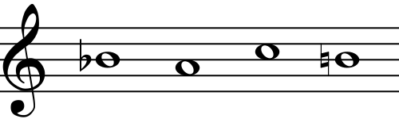
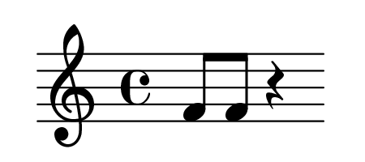
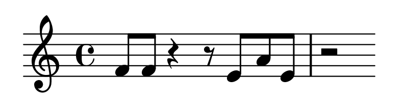
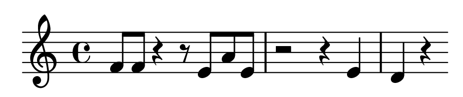
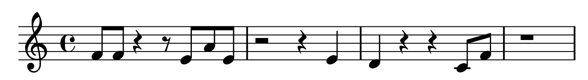
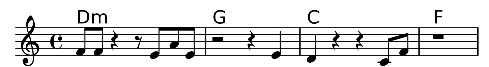
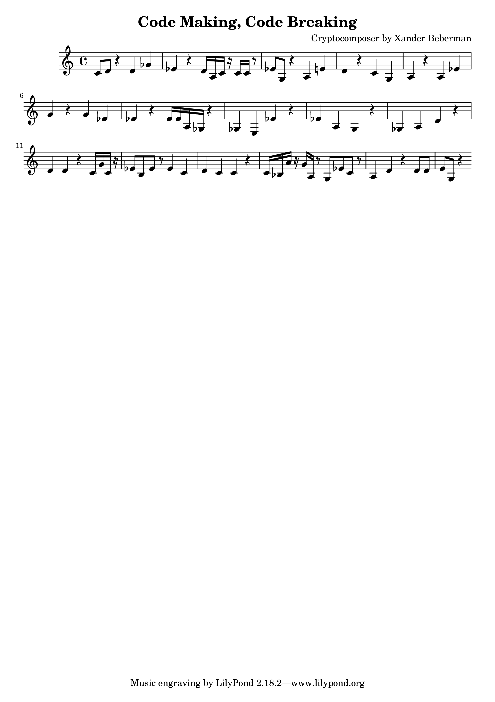
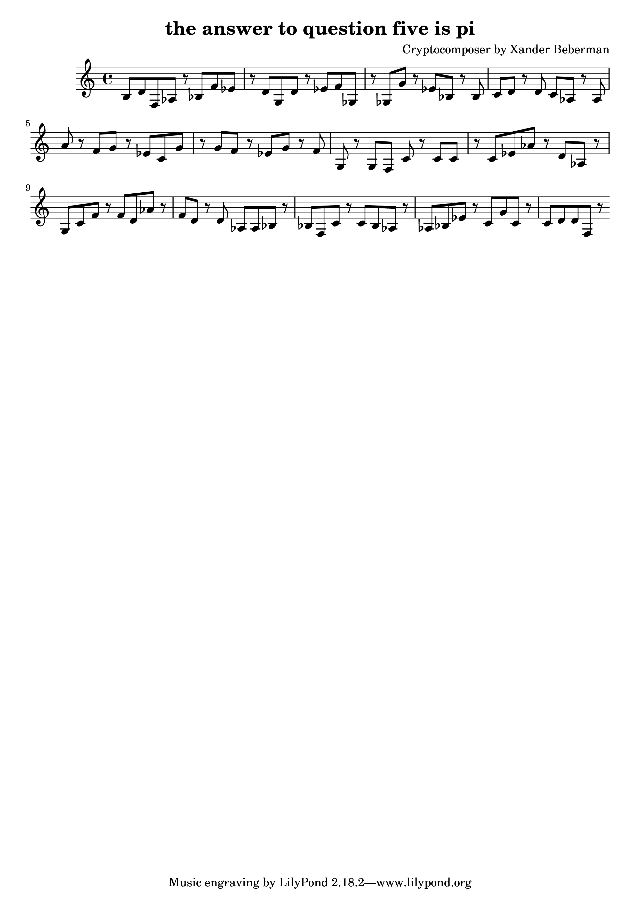

#Cryptocomposer: A Musical Encryption System
Xander Beberman  
Final project for LING 26040 Code Making, Code Breaking

##Intro

Musical encryption has been happening, at a limited level, since before modern notation existed. The most common methods of encryption use individual notes that correspond to individual letters. The simplest of these is to simply use the note names themselves (especially using the German convention of referring to B&#9837; as B and B&#9838; as H) to spell out words. Many composers, famously Bach, include motifs in compositions to convey short lines of text as a signature or nod to others.[^wiki] The obvious problem with this system is that it can only encode the letters A−H.

<figure>
	<center>
	
	<figcaption>The B-A-C-H motif</figcaption>
	</center>
</figure>

Other common systems either assign multiple letters to each note or use accidentals to differentiate between letters in sheet music.[^sams] The clear downside to these is that they are not easily reversible. Although decrypting using accidentals would be exact given a score, enharmonic pairs would create ambiguity between two letters when decrypting given only audio of the music. The other disadvantage of these systems is that their strictness might have negative repercussions on the quality of compositions created with them. Trying to encrypt even a fairly long message might necessitate composing with a difficult and dissonant series of notes.

My goal for this project was to create a system of musical encryption $E(x)$ that solves most, if not all of the problems with these common systems. Specifically, for the encryption to satisfy the following criteria:

* The encryption should translate unpunctuated text of the full English alphabet into music. The original intention was that the output of this encryption would be a monophonic melody with accompanying chords, although it ended up as just a melody.
* The encryption is totally reversible: $E^{−1}(E(x)) = x$ exactly.
* The encryption algorithm should be computationally implementable, and part of the project should implement a program that takes in text and outputs a score. However,
* The score is not a part of the encryption. Any in-the-know listener with a good ear should be able to figure out the plaintext.
* The music the algorithm produces should sound good (or at least not incredibly cacophonous). Whether I succeeded on this is best left to the listener.
* The score produced by the algorithm should not be restricted to playback on a specific instrument.
* It should be possible to produce multiple distinct encryptions of the same text.

[^wiki]: [Wikipedia, Musical cryptogram. en. June 2017.](https://en.wikipedia.org/w/index.php?title=Musical_cryptogram)
[^sams]: Eric Sams. “Musical Cryptography”. In: *Cryptologia* 3.4 (Oct. 1979), pp. 193–201. issn: 0161-1194.
##Encryption
###Algorithm
The encryption system I propose is based not on the notes themselves, but the intervals between them. Each letter in this system is represented as a shift of the previous letter by the product of intervals. Below is an outline of the encryption algorithm:

1. To encrypt a letter, begin with the previous letter $L_{i-1}$. If this is the first letter, assume $L_0$ is A.
1. Get the numeric shift $S$ between $L_{i-1}$ and the letter to encrypt $L_i$. For instance, if $L_{i-1}$ is C and $L_i$ is M, $S = 13 - 3 = 10$.
1. Choose a sequence of notes such that the product of the sizes of intervals between each pair of notes is equal to $S$. The sizes are in half steps: the sequence C, D, F has a product of $2 \cdot 3 = 6$. There are some exceptions to this:
	1. The size of an interval is not determined by the direction; the interval C, F has size 5, as does the interval F, C
	1. If a sequence contains only one note, it is decrypted as a shift of magnitude zero, i.e. $L_i = L_{i-1}$.
	1. If a sequence contains a note that is doubled, it is not considered an interval of size zero. Instead, it indicates that one should be added to the final product of intervals. For instance, the sequence C, D, D, F has a product of $(2 \cdot 3) + 1 = 7$.
1. Add a rest after the sequence to terminate it, and repeat.

Let's run through a step-by-step example. Suppose we want to encode our own version of the Bach motif. Start by determining the first shift. We have $L_1 = B$, and we recall $L_0 = A$. This means the first shift we must encode is 1. We don't want to begin our melody with a half step, so we can instead repeat the same note once:
<figure>
	<center>
	
	</center>
</figure>
The sequence F, F uses the rule described above to encode the shift 1. To get the next letter, we take $L_2 = A$. This is a shift of -1, or equivalently, 25. Since we don't want to use an interval of 25 half steps, we can use two intervals of size 5:
<figure>
	<center>
	
	</center>
</figure>
Then to get to $L_3 = C$ we use a simple whole step for shift 2:
<figure>
	<center>
	
	</center>
</figure>
And a fourth, or 5 half steps, to get from C to $L_4 = H$:
<figure>
	<center>
	
	</center>
</figure>
Then we can add some chords to make this seem like a real melody and not a secret message:
<figure>
	<center>
	
	</center>
</figure>
Take a listen:
<center>
<audio controls>
	<source src="site/example/bach.mp3" type="audio/mpeg" alt="B-A-C-H with chords audio">
	Your browser does not support the audio element.
</audio>
</center>

###Why This Algorithm?
Existing methods of musical encryption sound dissonant and may require sheet music to decrypt. These are properties I wanted to avoid while constructing my algorithm. Using intervals to represent letters instead of notes was the clearest solution---doing so allows the encryptor to choose notes more freely, since they are not as determined by the plaintext. By using combinations of intervals, the algorithm can produce large numbers without writing strange pieces with extended ranges. In addition, interval widths are much easier to hear than specific pitches, which helps this algorithm be decrypted without the aid of tuners or perfect pitch. The decision to use the product of intervals to get the shift rather than the sum comes from the one unbeatable aspect of single note--letter pairings: compactness. Using the sum of intervals would be more clear, but would require either wider intervals or longer sequences. To get from A--Z, one would still have to move a total of 25 half steps, which means writing either a few very large intervals or many small intervals. Using the product of intervals kept both of those cases to a minimum. The rule about doubled notes was included because it is difficult to find the product of some numbers, especially the many primes between 0--25. Allowing this rule helps give options to encryptors for how to succinctly write letters. Finally, I chose to make the shift for each letter dependent on the previous letter to create a more uniform distribution of shifts instead of one that depends heavily on the distribution of English letters. 

###Other Properties
One nice feature of this encryption system is that since the shift is modulo 26, there are an infinite number of shifts between two letters. This means that any shift can be represented by an arbitrarily long sequence of notes. In addition, since the shift is given by the product of intervals, any number of half steps included in a sequence will not change its shift. You can play the entire chromatic scale up and down the piano and the resulting shift will still be one.

##Program
The source code for this project is available to [view and download on GitHub.](https://github.com/xanwich/cryptocomposer)

###Structure
The script `cryptocomposer.py` is written in python and takes in an input text with some parameters and automatically generates a score that is encrypted using this method to correspond to the text. The file `dictionaries.py` contains some helpful constants.

The computational implementation of this algorithm works by taking in text, converting it to shifts to be encoded, and generating short phrases for each shift. To keep things simple, the program is based entirely in the key of C. Notes are saved by their pitch in number of half steps from middle C. Notes are saved in lists that I call "sequences," which each correspond to each letter in the input text.

###Generating Melodies
One of the goals of this project was to computationally generate melodies from text that sound passable: no phrases horrendously out of key or with constant, crazy jumps in pitch. This turned out to be the most difficult part of the project. I generated these melodies one letter, or one sequence at a time.

Using this method of encryption, each possible shift has an infinite number of possible sequences that correspond to it. Too keep things simple, I defined a number of simple interval sequences for each possible shift that are stored in `dictionaries.py`. However, deciding which sequence to use is still an issue. Each list of intervals can correspond to sequences starting on any note, with intervals going in any direction, and with its intervals in any order.[^doubles] I wanted to give the computer a number of options to choose from, but did not want to make the search space too large in order to keep performance reasonable. The answer I chose was to randomize each sequence. The algorithm for creating one candidate sequence given a starting note and a list of intervals is as follows:[^random]

```
make_sequence(interval_list, starting_note):
	randomly shuffle interval_list
	note_sequence <- new list containing starting_note
	for each interval in interval_list:
		sign <- randomly choose -1 or 1
		new_note <- last element of note_sequence + sign * interval
		append new_note to note_sequence
	return note_sequence
```
This describes how to create a candidate sequence, but not how to choose the best one. To do this, I created a system of penalties that are applied to sequences when determining which to use. The penalties are:

* **In Key:** At runtime, a scale is specified---this can be the major, minor, harmonic minor, or major pentatonic scale. Each note in a sequence that is not in the specified scale is penalized with a constant. So a sequence with one note out of the scale has penalty $3$, whereas a sequence with four notes out of key has penalty $4 \cdot 3 = 12$.
* **Distance from Center:** To avoid creating large jumps in intervals or straying to far up or down the scale, each note in a sequence is penalized by its squared distance from middle C. The sequence $S$ is penalized as $\frac{1}{25}\sum_{n \in S} n^2$.
* **Sequence Length:** To avoid excessively long sequences, each sequence $S$ is also penalized by $2 \cdot (\text{length}(S) - 2)$, or not at all if the sequence is of length two or less.
* **Voice Leading:** To avoid large jumps between sequences, each sequence is also penalized by the difference between its first note and the previous sequence's last note. If $p$ is the last note in the previous sequence and $s$ is the first note in the current sequence, the penalty is $|s-p|$. For the first sequence, $p = 0$.

For each shift $S$, the program takes each list of intervals associated with $S$ and creates candidate sequences for each list of intervals for every starting note between a fifth below and a fifth above the last note in the previous sequence. It also does the same for each list of intervals associated with $S-1$, to each of which a randomly doubled note is added. Then it calculates the sum of penalties for every candidate, and chooses the candidate with the lowest value. This results in generally consonant and reasonable sequences. The program does this for each shift in the message, and voila: it ends up with a melody that decrypts to the input text.

[^doubles]: The double-note rules have not yet been addressed at this step, so the order of intervals does not matter.
[^random]: In the source code, this function is called `make_sequence`, and has other, non-random options for choosing interval signs, such as `up` and `down`, which always make sequences ascending or descending, respectively, or `center`, which always adds the next note in the direction of middle C.

###Generating Scores
To generate the scores and MIDI files for each are generated using [LilyPond.](http://lilypond.org/) For my sanity, the program only uses flats and all sequences are aligned to start and end on quarter notes.

###Running
To run this, you need Python and LilyPond command-line tools installed. I have not tested it on anything except my Macbook, so I have no idea if it will work for you.

Use with

`python cryptocomposer.py (-t TEXT | -i INPUT) (-o OUTPUT) [options]`

With inputs and options as follows:

* `-t TEXT`: *Required.* `TEXT` is the plaintext to encode, typed directly into the command line (in quotes). -t takes precedence over -i
* `-i INPUT`: *Required.* `INPUT` is the path to a text file containing the plaintext to encode.
* `-o OUTPUT`: *Required.* `OUTPUT` is the path to which the ciphertext is written
* `-s SCALE`: *Optional.* `SCALE` is the scale to use for In Key penalties. The options for this are:
	* `major`: *(default)* major scale
	* `minor`: minor scale
	* `harmonic`: harmonic minor scale
	* `pentatonic`: major pentatonic scale
* `-l LENGTH`: *Optional.* `LENGTH` is the note length and rest length to use when generating sequences. Options for this are:
	* `random`: *(default)* randomly chooses quarter, eighth or sixteenth notes to use for each sequence. If this option is chosen, sequences will be aligned to start and end on quarter notes.
	* `4`, `8`, or `16`: quarter, eighth, or sixteenth notes, respectively. If this option is chosen, the rests following sequences will have length equal to the note length.
* `-h`: *Optional.* Show the usage screen and exit the program.

###Examples
Let's encode the phrase "Code Making, Code Breaking," with random note lengths in the major pentatonic scale. Let's call the output files "codes" and put them on our desktop. We navigate to the folder where `cryptocomposer.py` is stored and run:

```
python cryptocomposer.py -t "Code Making, Code Breaking" -o ~/Desktop/codes -s pentatonic -l random
```

This outputs three files: codes.ly, codes.pdf, and codes.midi. The pdf file contains the score of our output, the midi file contains a MIDI conversion of the score, and the `.ly` file is a LilyPond file used to generate the other two. Here is an example of a pdf generated by this command:
<figure>
	<center>
	
	<figcaption>PDF output of 'Code Making, Code Breaking' encrypted by Cryptocomposer</figcaption>
	</center>
</figure>
And its accompanying MIDI file:
<center>
<audio controls>
	<source src="site/codes.mp3" type="audio/mpeg" alt="MIDI version of 'Code Making, Code Breaking' encrypted by Cryptocomposer">
	Your browser does not support the audio element.
</audio>
</center>
A little odd. Let's try encoding something else, maybe with a different scale and a set note length. This time we'll set up a text file on our desktop called `math.txt` and it will contain the text

```
the answer to question five is pi
```

Then we run

```
python cryptocomposer.py -i ~/Desktop/math.txt -o ~/Desktop/math -s minor -l 8
```
and get this PDF:
<figure>
	<center>
	
	<figcaption>PDF output of 'the answer to question five is pi' encrypted by Cryptocomposer</figcaption>
	</center>
</figure>
And its MIDI file, played with an accompanying C pedal once every bar to illustrate the ominousness of this composition:
<center>
<audio controls>
	<source src="site/math.mp3" type="audio/mpeg" alt="MIDI version of 'the answer to question five is pi' with C bass drone encrypted by Cryptocomposer">
	Your browser does not support the audio element.
</audio>
</center>

Now, finally, I have a means of conveying answers to problem sets to my friends secretly! I'll just play this piece at my next modernist piano recital and no one will be able to stop us!

##Possible Next Steps
Cryptocomposer was a fun project, but is by no means a comprehensive method of implementing a generator for this encryption algorithm, or even a complete encryption algorithm! There are many places that this could be taken. Below is a list of a few extensions that could make this project even better.

* Updating the encryption algorithm to use a key[^pun]
* Adding more pieces to the sequence generation algorithm, such as
	* Adding more scales
	* A penalty for interval jumps
	* Penalties for strangely constructed rhythms
	* Repeating motifs when shifts repeat
	* Automated transposition and modulation
* Or ditch this sequence generation entirely and use machine learning to create melodies[^fugue] [^asimov]
* Add in an algorithm to generate chords in response to the melodies
* This encryption algorithm lends itself really well to automatically including a substitution or Vigenère cipher, which could be included in the program

[^pun]: There's a great pun to be had here, but I couldn't quite figure out how to implement it.
[^fugue]: [Garay Acevedo A. (2005) Fugue Composition with Counterpoint Melody Generation Using Genetic Algorithms. In: Wiil U.K. (eds) Computer Music Modeling and Retrieval. CMMR 2004. Lecture Notes in Computer Science, vol 3310. Springer, Berlin, Heidelberg](https://link.springer.com/chapter/10.1007/978-3-540-31807-1_7)
[^asimov]: [Brinkkemper, Frank. October 5, 2016. *Analyzing Six Deep Learning Tools for Music Generation.* The Asimov Institute.](http://www.asimovinstitute.org/analyzing-deep-learning-tools-music/)